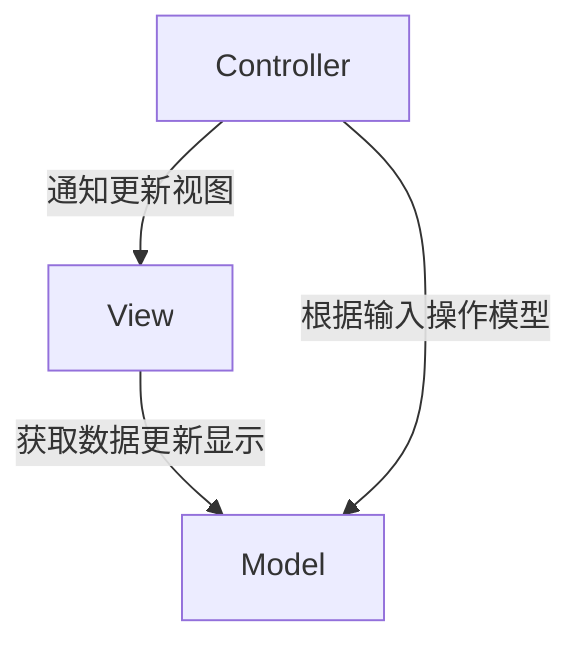
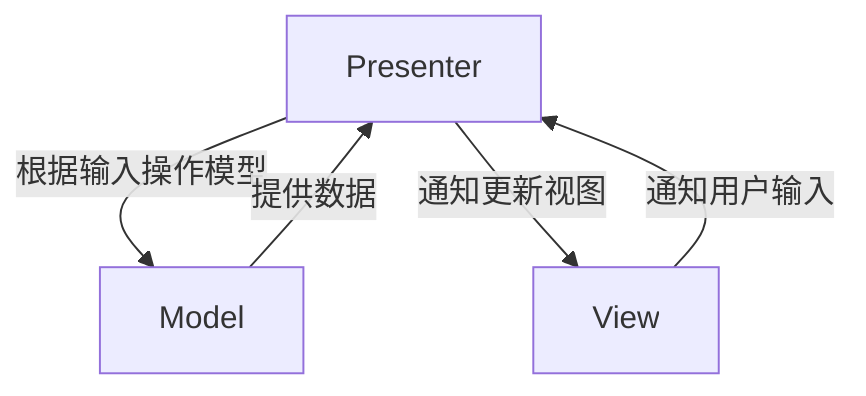
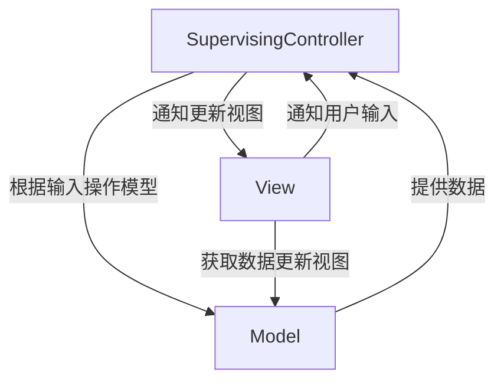
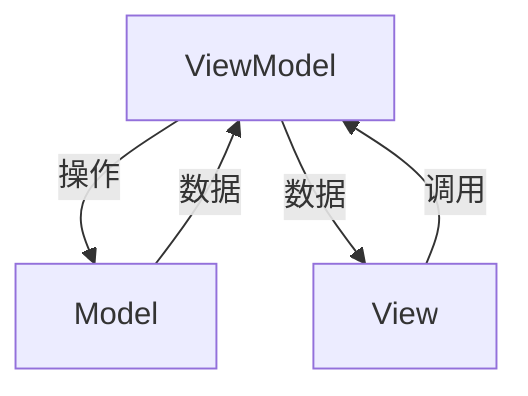
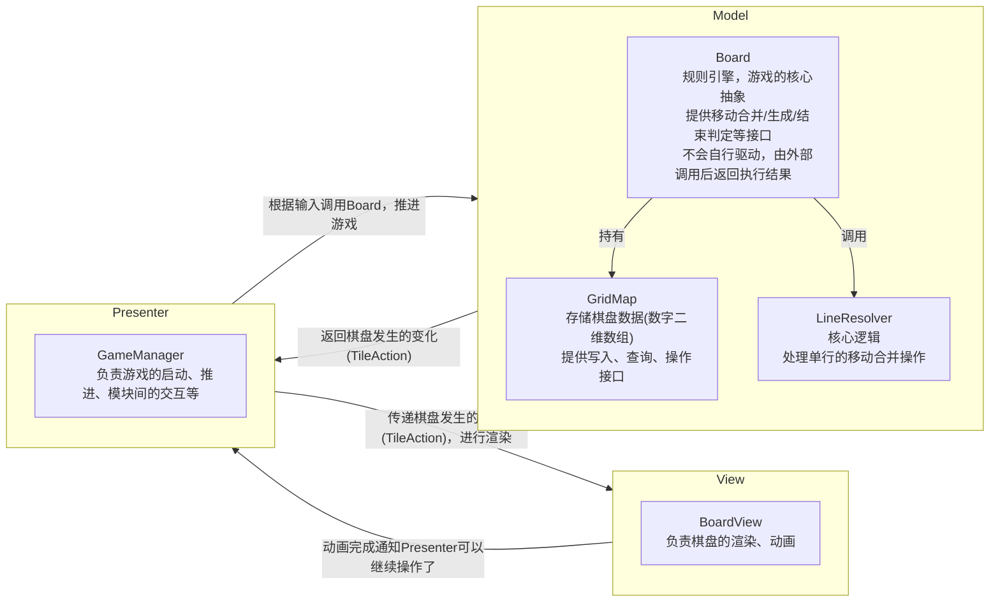
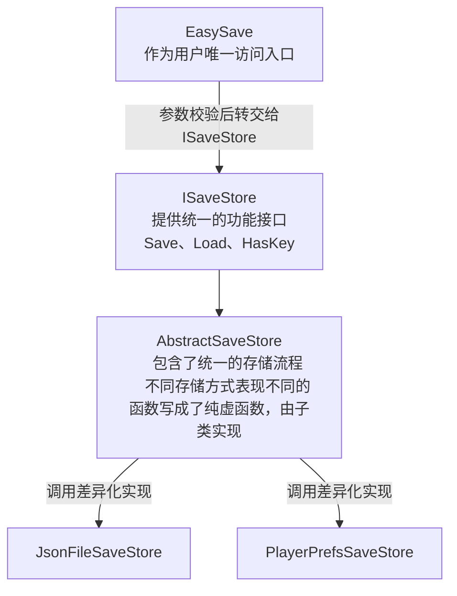
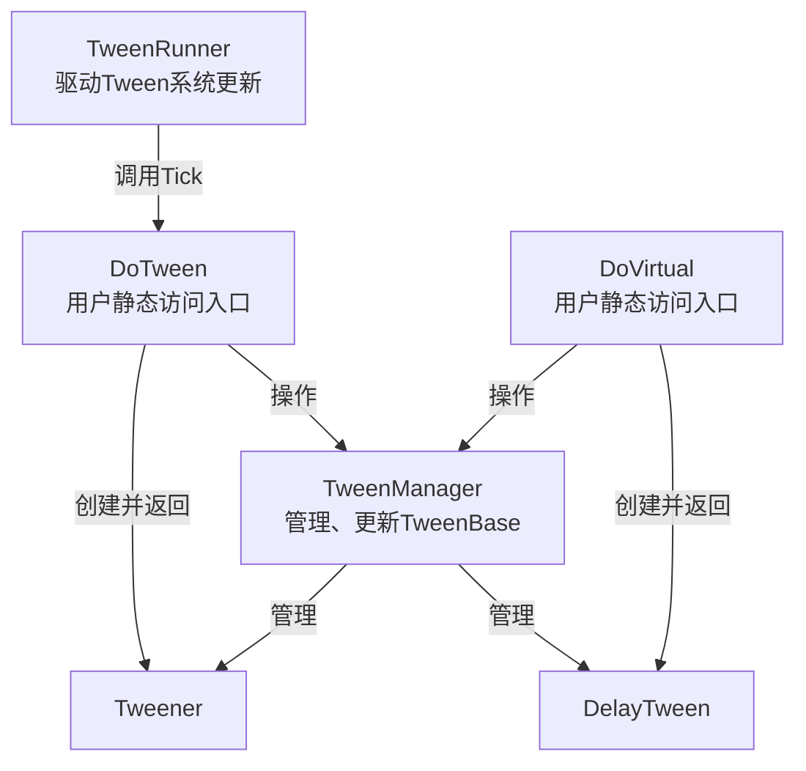

[TOC]

# 架构
## MVC (Model-View-Controller)

* **Model**: 业务数据和规则
* **View**: 显示
* **Controller**: 根据输入操作模型，然后通知View层更新，View层从Model中取数据进行更新

## MVP (Model-View-Presenter)
### Passive View

* **Model**: 业务数据和规则
* **View**: 显示
* **Presenter**: 根据输入操作模型，然后根据Model层返回的结果控制View层更新

Model和View完全解耦

### Supervising Controller

* **Model**: 业务数据和规则
* **View**: 显示
* **SupervisingController**: 根据输入操作模型，然后根据Model层返回的结果控制View层更新

将一些简单的同步直接放在View中，避免Presenter过大

## MVVM (Model-View-ViewModel)

* **Model**: 业务数据和规则
* **View**: 显示
* **ViewModel**: 操作Model，将Model数据转换为View层直接需要的数据存储下来，并提供一些行为接口给View层

ViewModel层相当于对Model层进行了进一步封装，更适合View层获取数据和调用。一般View层会和ViewModel层进行一些数据绑定，ViewModel变化直接同步到View层。对于用户输入，可以由View层调用ViewModel的接口，也可以将输入绑定到ViewModel的行为。可以单独再写一个Binding专门负责完成View层和ViewModel的绑定。

## 总结
MVC、MVP、MVVM本质都是将业务(数据、逻辑)和显示分离，然后通过某种方式将他们连接起来，把业务数据显示出来。区别在于数据如何传递、业务数据到要展示的数据在哪处理转换、在哪判断用户输入要如何处理以及由前面的问题导致的依赖关系的不同。

## 当前项目架构

# 设计模式
## 观察者模式

**它用于每当发生了某件事A时，就想要执行B、C、D等操作的情况下。作用是解耦通知方和接收方**

比如本项目中，当用户点击了重新游戏按钮时，就重新开始游戏。用户点击了重新游戏按钮在`UIGameOver`中，重新开始游戏在`GameManager`中。最直接的方式就是在`UIGameOver`中，用户点击了重新游戏按钮时直接调用`GameManager`的`CheckGameOver`，但是这样的话，`UIGameOver`就直接依赖`GameManager`了。而`GameManager`应该是上层，`UIGameOver`应该是下层，也就是下层依赖上层了。这样是不好的，我们最好保持架构上层对下层的单向依赖，因为上层统筹调用下层是很自然的，下层应该是供上层使用的。

使用了`观察者模式`后，`UIGameOver`就只负责通知事件发生了，不再依赖任何需要响应事件的类(如`GameManager`)，只关注于自己。这是解开了下层依赖上层的耦合，同样也可以用于解开同层之间的耦合。总之，**它去掉了通知方对于所有接收方的依赖**，让通知方甚至可以写成完全独立的类，我们可以写很多这种接近独立类，然后通过上层调控脚本和观察者模式将他们串起来，其实就是组件化的思想了。

## 工厂模式

`TileAction`通过工厂模式传入指定参数来创建对应类型，避免填错参数等

## 策略模式

将一组可互换的算法封装成单独的类，实现相同的接口或继承自相同的基类实现，这样就能根据需求创建不同的类，由于接口相同，调用方不用知道具体用的哪种实现

比如本项目中的`JsonFileSaveStore`和`PlayerPrefsSaveStore`都继承自`AbstractSaveStore`，`AbstractSaveStore`实现了`ISaveStore`接口。游戏启动后根据玩家配置创建对应的实现类，存放到`ISaveStore`引用中，调用方对于两种实现进行调用的代码是相同的。

# 存储系统

## 架构

# Tween系统

## 架构
