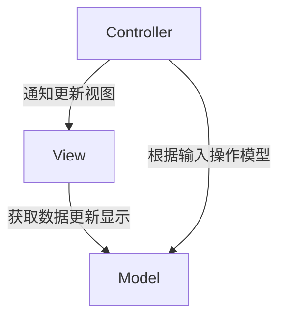
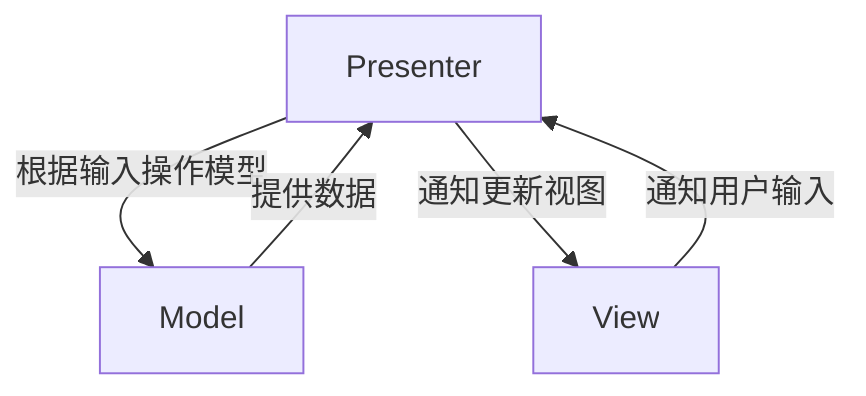
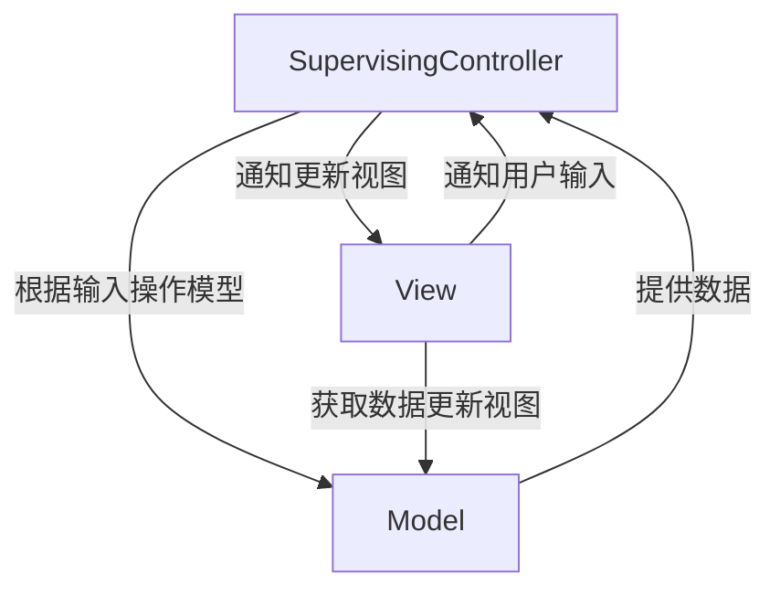
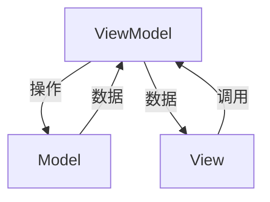
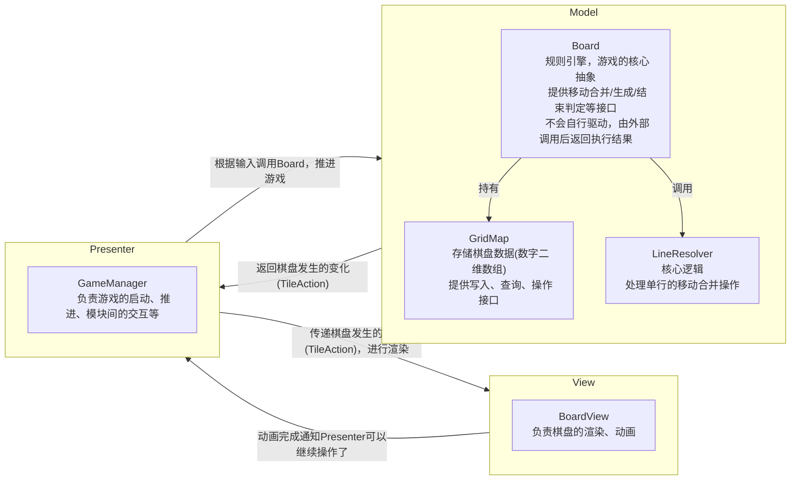

[TOC]

# 架构
## MVC (Model-View-Controller)

* **Model**: 业务数据和规则
* **View**: 显示
* **Controller**: 根据输入操作模型，然后通知View层更新，View层从Model中取数据进行更新

## MVP (Model-View-Presenter)
### Passive View

* **Model**: 业务数据和规则
* **View**: 显示
* **Presenter**: 根据输入操作模型，然后根据Model层返回的结果控制View层更新

Model和View完全解耦

### Supervising Controller

* **Model**: 业务数据和规则
* **View**: 显示
* **SupervisingController**: 根据输入操作模型，然后根据Model层返回的结果控制View层更新

将一些简单的同步直接放在View中，避免Presenter过大

## MVVM (Model-View-ViewModel)

* **Model**: 业务数据和规则
* **View**: 显示
* **ViewModel**: 操作Model，将Model数据转换为View层直接需要的数据存储下来，并提供一些行为接口给View层

ViewModel层相当于对Model层进行了进一步封装，更适合View层获取数据和调用。一般View层会和ViewModel层进行一些数据绑定，ViewModel变化直接同步到View层。对于用户输入，可以由View层调用ViewModel的接口，也可以将输入绑定到ViewModel的行为。可以单独再写一个Binding专门负责完成View层和ViewModel的绑定。

## 总结
MVC、MVP、MVVM本质都是将业务(数据、逻辑)和显示分离，然后通过某种方式将他们连接起来，把业务数据显示出来。区别在于数据如何传递、业务数据到要展示的数据在哪处理转换、在哪判断用户输入要如何处理以及由前面的问题导致的依赖关系的不同。

## 当前项目架构
