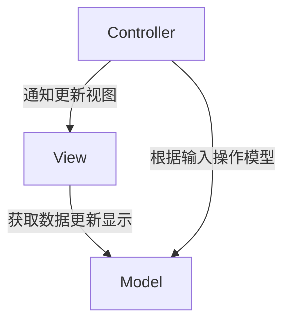
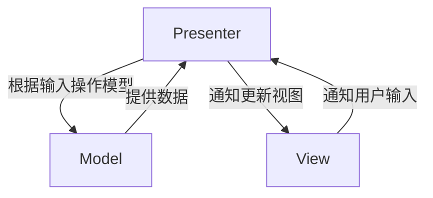
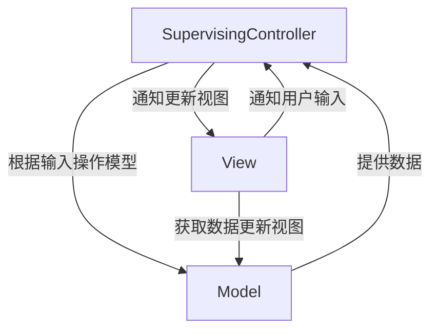

[TOC]

# 架构
## MVC (Model-View-Controller)

* **Model**: 业务数据和规则
* **View**: 显示
* **Controller**: 根据输入操作模型，然后通知View层更新，View层从Model中取数据进行更新

## MVP (Model-View-Presenter)
### Passive View

* **Model**: 业务数据和规则
* **View**: 显示
* **Presenter**: 根据输入操作模型，然后根据Model层返回的结果控制View层更新

### Supervising Controller

* **Model**: 业务数据和规则
* **View**: 显示
* **SupervisingController**: 根据输入操作模型，然后根据Model层返回的结果控制View层更新

将一些简单的同步直接放在View中，避免Presenter过大