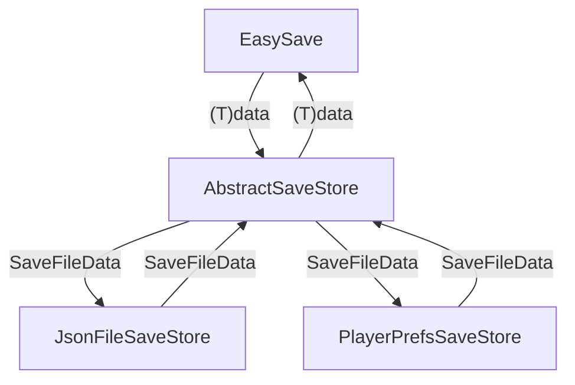

# 简介
模仿`EasySave`接口和功能实现的存储系统

# 序列化
目前只实现了json序列化，且还是用的Unity自带的`JsonUtility`，由于`JsonUtility`不支持`int`、`float`这样的基础类型以及数组之类的，所以在序列化之前统一将数据装到`Wrapper<T>`中，这样基础数据类型就能存了，并让嵌套类型格式和基础类型一致

```C#
[Serializable]
class Wrapper<T> {
    public T data;
    public Wrapper<T>(T data) {
        this.data = value;
    }
}

[Serializable]
class ExampleData {
    public int data1 = 1;
    public float data2 = 1.1f;
    public bool data3 = true;
    public string data4 = "string";
}
serializer.Serialize(new ExampleData());
转出来的数据格式大概像下面这样
{"data":{"data1":1,"data2":1.1,"data3":true,"data4":"string"}}

int data = 1;
serializer.Serailize(data);
转出来的数据是这样
{"data":1}

也就是转出来的数据外面会套一层`{"data":};
```

# 存取
当前实现是在同一个文件中存多个`key`对应的数据，所以需要进行`key`的管理。定义了两个数据结构来方便操作，`SaveFileData`对应一整个文件的内容，`SaveEntry`对应一个`key-value`对，一个文件中有多个`key-value`对，所以`SaveFileData`中放的是`SaveEntry`列表。两个类都用了`[Serializable]`，所以实际存取时只要使用这两个数据结构来操作就行了，它们对应的序列化和反序列化操作会自动在`Serializer`中完成

```C#
[Serializable]
internal class SaveEntry
{
    public string Key;
    public string Value;
}

[Serializable]
internal class SaveFileData
{
    public List<SaveEntry> Entries = new();
}
```
实际一个文件中存储的数据会是这样的
```json
{"Entries":[{"Key":"HighScore","Value":"{\"data\":1476}"}]}
```
顶层是`Entries`，包含多个`Key-Value`对，`Value`中是数据序列化的内容，由于我们使用了`Wrapper<T>`包了一层，所以实际数据外面多了一层`data`

# 数据流

`EasySave`只是个入口，进行参数校验后发给`AbstractSaveStore`


`AbstractSaveStore`负责`(T)data`这种具体数据与`SaveFileData`、`SaveEntry`这种抽象的数据结构之间的序列化/反序列化，以及对这些数据结构的操作，具体的存取由具体的存储层负责

`JsonFileSaveStore`、`PlayerPrefsSaveStore`这种具体的存储层只将负责`SaveFileData`这种抽象化后的数据存储到具体的存储介质中，或从中取出，它们对数据的具体类型是不感知的，具体的数据以序列化后的形式存在了`SaveFileData`中

# 考虑的问题
## null的处理
对null的处理是在入口处直接抛异常拦截，我觉得传null在语义上就是不对的
```C#
Save(key, null);    // 这不就是不存数据吗，那其实根本就没必要调用
Save(null, data);   // null作为key我觉得不成立
Load(key);          // 不成立
```

## 写存档
如果直接在原存档文件上写，那么如果中途出现意外导致中断(如断电、游戏崩溃、磁盘异常)，那么原来的存档就可能损坏

常见的作法是先写到临时文件里，临时文件写入成功后删除原文件，然后重命名临时文件

不过`File`中提供了现成的`Replace(tmp, target, backup)`接口，已有存档时可以使用这个接口，没有时就用`Move()`重命名文件

## PlayerPrefs存储中对文件名的处理
我想到的有两种实现方式

**1.文件名和key组合成fullKey，作为PlayerPrefs中的key**

这种方式的优点是**实现简单，不用在PlayerPrefs的一项数据中维护多个`key-value`对**

缺点是**file、key的语义不清晰了，读数据时只有fullKey不存在，而不知道具体是file不存在还是key不存在，如果要提供`FileExists()`接口，那就没法实现了**

**2.文件名作为PlayerPrefs中的key**

这种方式需要在`PlayerPrefs`的一项数据中维护多个`key-val`对，但是**file、key语义清晰，并且和json文件处理逻辑一致**，那么它们其实有很多公共逻辑是可以共享的

我一开始用的是第一种方式，后面在重新考虑错误处理时发现这样没法区分文件不存在还是key不存在，所以改用了第二种方式

## 一开始没思考清楚导致问题
最开始我只是模仿`Easy Save`的外层调用接口，`Save<T>(string key, T data)`、`T Load<T>(string key)`，但是没有想清楚它的语义、定界、错误(边界)情况，是写到后面考虑读取错误时思考发现写的有问题，根据发现的问题改进接口、设计，最后跟`Easy Save`的设计不谋而合了。当然没有一开始想清楚应该也有部分原因是没有写过，这是第一次接触，对于具体会做些什么事、会发生些什么情况，脑子里没有清楚的认知。所以有的时候早点做起来而不是一直在设计阶段空想可能要更好，因为在没有经验的情况下，本身就是很难想清楚的。不如有大致的想法就先做，在做的过程中自然会建立更清晰的认知，还可能会碰到一些问题，这些问题会进一步强化我们的认知，并且在设计时，这些问题很可能就是关键的考虑点。

具体情况是，我一开始根据`Easy Save`的接口，想了下大致实现思路就开始写了，没有考虑读取时文件不存在、没找到key之类的情况怎么处理，只是在写的时候很随意的给了一个处理，比如`T Load<T>(string key)`时如果没找到文件，那就返回T类型的默认值。后面写完了，也正常运行了，我就开始完善，比如把直接在原文件上写数据改成了先写到临时文件再替换，因为直接写文件碰到意外中断，会导致坏档。这也就促使我思考如果出现了坏档要怎么处理，比如我一开始想的是返回读取数据的默认值，然后将存档文件重命名为`原文件名.broken`，并进一步的仔细思考各种错误(边界)情况要怎么处理。想着想着，我突然发现，**坏档怎么处理之类的感觉应该是游戏(业务)层面的，而不应该由工具层自己来处理，工具层在发生可预见的错误时，直接将错误抛出让使用者自行决定怎么处理就行了。如果由工具自行处理了，一是限制了使用者的自由，二是可能会掩盖掉一些错误，使用者都没有知晓**。想到了这一点后，数据持久化系统本身的实现就简单清晰多了。